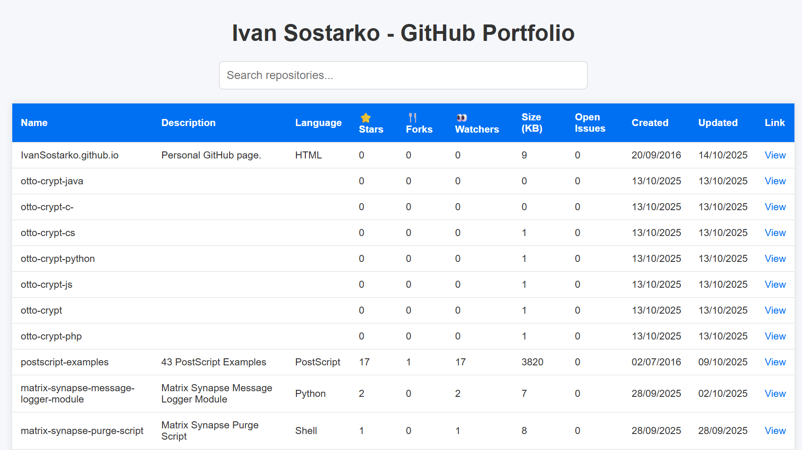

# 🧩 GitHub Repositories Portfolio

A clean and responsive **GitHub Pages** website that automatically lists all your public GitHub repositories in a searchable and filterable table.

🌐 **Live Site:** [https://ivansostarko.github.io](https://ivansostarko.github.io)

---

## 🏷️ Badges


---

## 🚀 Features

- 🔄 **Auto-fetch repositories** from the GitHub API  
- 🔍 **Global search** across all columns  
- 🧩 **Per-column filtering**  
- 📱 **Responsive design** (works on desktop & mobile)  
- ⚙️ **GitHub Actions** workflow that keeps your site automatically refreshed  
- 💡 100% **client-side** — no backend or build step required  

---

## 🧠 How It Works

The site fetches your public repositories from:

```
https://api.github.com/users/YOUR_USERNAME/repos?per_page=100
```

and builds a table with columns:

| Column | Description |
|--------|--------------|
| Name | Repository name |
| Description | Short summary |
| Language | Main programming language |
| ⭐ Stars | Number of stargazers |
| 🍴 Forks | Fork count |
| 👀 Watchers | Watcher count |
| Size (KB) | Repo size |
| Open Issues | Count of open issues |
| Created | Creation date |
| Updated | Last update date |
| Link | Repository URL |

---

## 🛠️ Setup Instructions

1. **Create a new repository** named:
   ```
   username.github.io
   ```
   This will automatically enable GitHub Pages hosting.

2. Add your `index.html` file (the main portfolio page).

3. Commit and push to the `main` branch.

4. Visit:
   ```
   https://username.github.io
   ```

---

## 🧩 Customization

- **Change GitHub username**
  ```js
  fetch('https://api.github.com/users/YOUR_USERNAME/repos?per_page=100');
  ```

- **Add or remove columns**
  Edit the `<th>` and `<td>` sections in `index.html`.

- **Dark mode / Sorting**
  You can enhance it easily with a theme toggle or clickable sortable columns.

---

## 🖼️ Screenshot

```

```

---


## 📄 License

This project is released under the **MIT License** — free to use and modify.

---

### Credits

Built by [**@ivansostarko**](https://github.com/ivansostarko)  
Powered by the [GitHub REST API](https://docs.github.com/en/rest)  
Hosted on **GitHub Pages**
